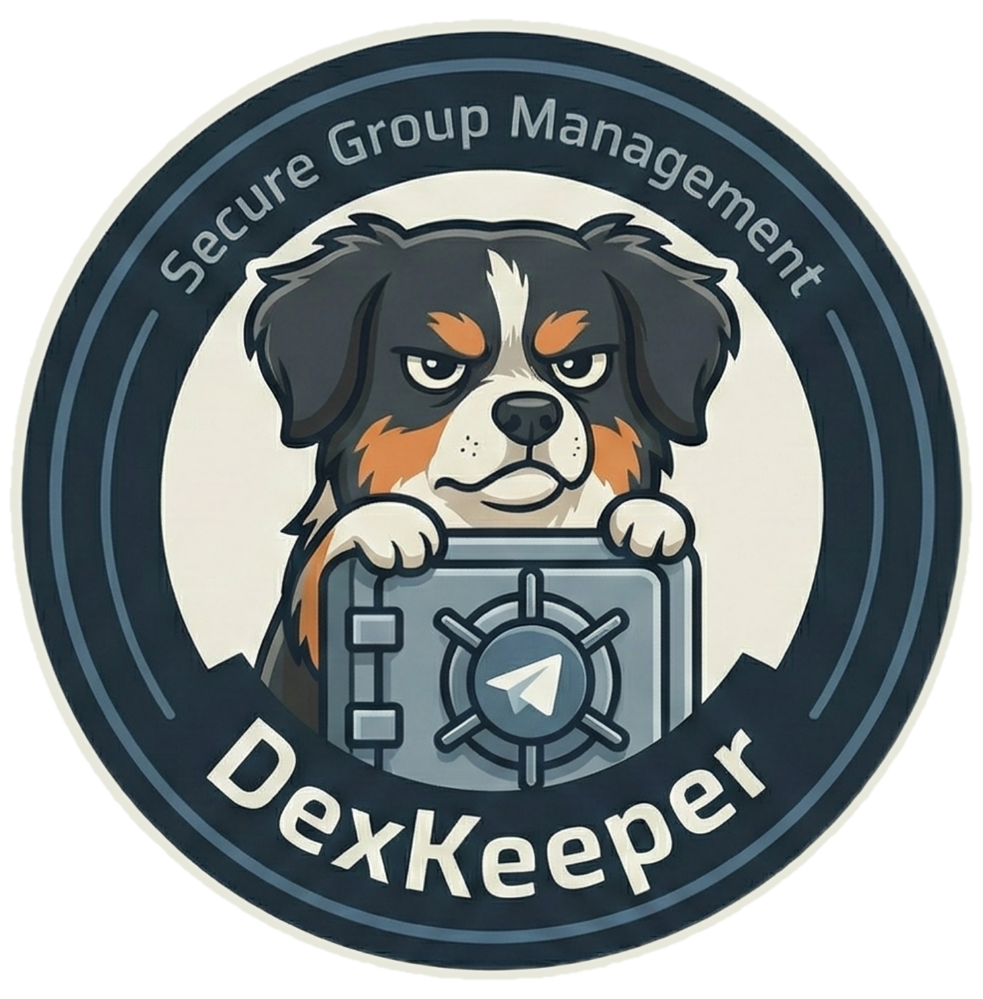

<div align="center">
  
</div>

<div align="center">


[](https://github.com/sponsors/westkitty)
[](https://ko-fi.com/westkitty)

</div>

# DexKeeper_Bot

A high-performance, privacy-focused Telegram group management bot. DexKeeper runs in a containerized environment, ensuring consistent performance and easy deployment across any system that supports Docker.

## Key Features

- **Automated Moderation:** Keep your group clean with automated filters and checks.
- **Verification System:** "I am Human" captcha to prevent bot spam.
- **Privacy First:** All data is stored locally in SQLite (`data/dexkeeper.db`).
- **Dockerized:** Deploy anywhere (Linux, macOS, Windows) with a single command.
- **User Management:** Ban, Unban, Promote, and Export user data.
- **Engagement Tools:** Polls, Welcomes, and Scheduled messages.

## Installation

### Option A: Download Source Release
Download the latest source code from the [Releases](https://github.com/westkitty/DexKeeper_Bot/releases) page.

### Option B: Quick Start (The One-Liners)

**Linux / macOS / WSL2:**
Run this single block to download, configure, and start the bot instantly (assumes Docker is installed):

```bash
git clone https://github.com/westkitty/DexKeeper_Bot.git && cd DexKeeper_Bot && echo "BOT_TOKEN=ReplaceWithYourToken" > .env && cd scripts && docker-compose up -d --build
```

*(Note: You must edit `.env` with your actual token after this runs, then restart)*

## Detailed Setup

1.  **Clone the Repository:**
    ```bash
    git clone https://github.com/westkitty/DexKeeper_Bot.git
    cd DexKeeper_Bot
    ```

2.  **Configure Environment:**
    Create a `.env` file in the root directory and add your Telegram Bot Token:
    ```bash
    echo "BOT_TOKEN=YOUR_ACTUAL_TOKEN_HERE" > .env
    ```

3.  **Run with Docker Compose:**
    Navigate to the scripts folder and launch:
    ```bash
    cd scripts
    docker-compose up -d
    ```

## Governance

Remain ungovernable so Dexter approves.

### **Public Domain / Unlicense:**

This project is dedicated to the public domain. You are free and encouraged to use, modify and distribute this software without any attribution required.
You could even sell it... if you're a capitalist pig.

---

## Why Dexter?

*Dexter is a small, tricolor Phalène dog with floppy ears and a perpetually unimpressed expression... ungovernable, sharp-nosed and convinced he’s the quality bar. Alert, picky, dependable and devoted to doing things exactly his way: if he’s staring at you, assume you’ve made a mistake. If he approves, it means it works.*
