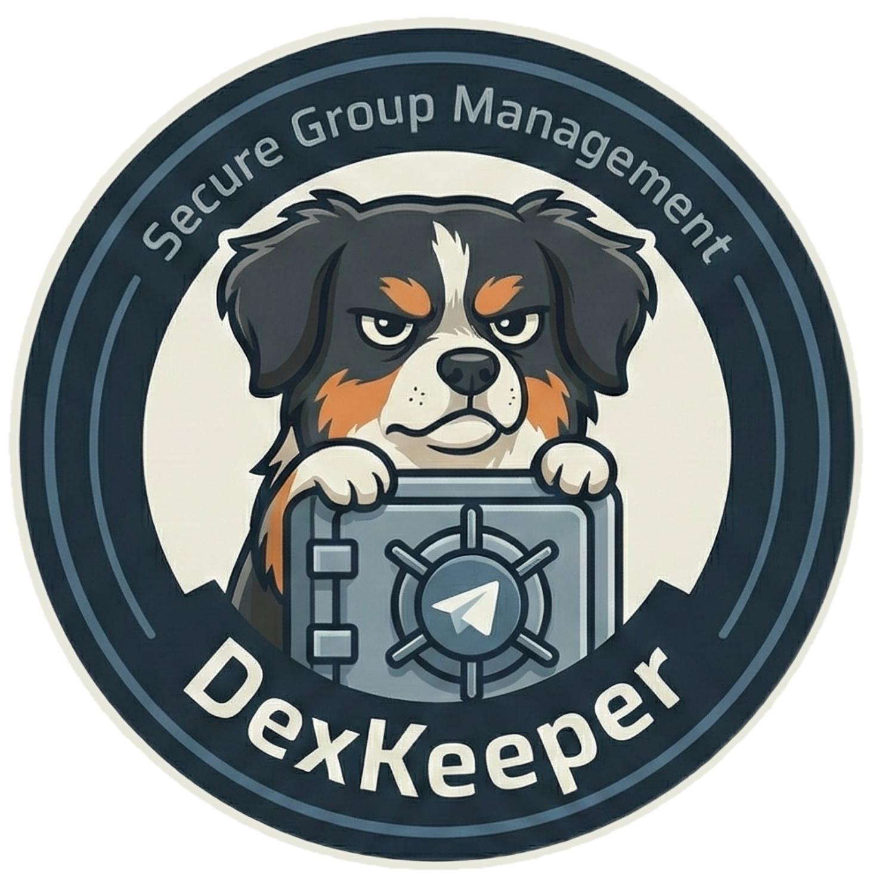

<div align="center">
  
</div>

<div align="center">


[](https://github.com/westkitty/DexKeeper_Bot/releases/latest)
[](https://github.com/westkitty/DexKeeper_Bot/actions/workflows/windows-build.yml)
[](https://github.com/westkitty/DexKeeper_Bot/actions/workflows/macos-build.yml)
[](https://github.com/westkitty/DexKeeper_Bot/actions/workflows/linux-build.yml)
[](https://github.com/sponsors/westkitty)
[](https://ko-fi.com/westkitty)

</div>

# DexKeeper_Bot

**DexKeeper** is a self-hosted Telegram bot for single-community moderation and admin workflows. It runs as a polling bot, stores state locally in SQLite, and includes optional desktop tray controls for packaged installs.

Unlike cloud bots, **you host this yourself**. Your data, your rules, your hardware.

---

## 🌟 Features

### 🛡️ Security & Moderation
- **Human verification**: Restricts new members until they press the verification button.
- **Lockdown mode**: Immediately rejects newly joined members while lockdown is enabled.
- **Bad word filter**: Deletes group messages containing configured blocked strings.
- **Flood gate**: Restricts users who post more than 5 messages inside 2 seconds.

### 📢 Engagement Tools
- **Welcome Messages**: Customizable greeting for verified members.
- **Polls**: Create native Telegram polls from the admin panel and post them to the managed group.
- **Broadcast**: Send a direct message to every user recorded in the local user database.
- **Scheduled Messages**: Queue a message for the managed group after a delay in minutes.
- **Forum Topics**: Create topics in a forum-enabled supergroup.

### 🎥 Utilities
- **Zoom Enforcer**: Detects raw Zoom links and reposts them in a formatted card style.
- **User Management**: View, ban, unban, and promote users from the admin panel.
- **CSV Export**: Export the local SQLite-backed user database as CSV.

---

## 📋 Prerequisites

Before you start, you need:
1. **A Telegram bot token** from [@BotFather](https://t.me/BotFather)
2. **A Telegram account** to act as admin
3. **One runtime path**
   - Docker / OrbStack / Docker Desktop, or
   - Python 3.11+ for a direct source run

---

## 🤖 Phase 1: Get Your Bot Token

You need to tell Telegram "I am making a bot" and get a key to control it.

1.  Open Telegram and search for **@BotFather**.
2.  Click **Start**.
3.  Type `/newbot` and press Enter.
4.  **Name your bot** (e.g., "My Super Group Manager").
5.  **Choose a username** (must end in `bot`, e.g., `MySuperManager_bot`).
6.  BotFather will reply with a long string of text under "Use this token to access the HTTP API:".
    *   **COPY THIS TOKEN.** It looks like: `123456789:ABCdefGHIjklMNOpqrsTUVwxyz`.
    *   *Treat this like a password. Do not share it.*

---

## 💻 Phase 2: Installation Guide

### ✅ Option A: One‑Click Installers (Easiest)

These are the fastest, recommended installs. No command line required.

**Windows (Easiest)**
1. Download **[DexKeeper-Setup.exe](https://github.com/westkitty/DexKeeper_Bot/releases/latest/download/DexKeeper-Setup.exe)**.
2. Run it. If SmartScreen appears, click **More info → Run anyway**.
3. A setup window asks for `BOT_TOKEN` and optional `ADMIN_ID`.
4. DexKeeper stores data in `%APPDATA%\DexKeeper`.

**macOS (Easiest)**
1. Download **[DexKeeper.dmg](https://github.com/westkitty/DexKeeper_Bot/releases/latest/download/DexKeeper.dmg)**.
2. If the DMG is blocked or unavailable, download **[DexKeeper-macos.zip](https://github.com/westkitty/DexKeeper_Bot/releases/latest/download/DexKeeper-macos.zip)** instead.
2. Open the DMG and drag **DexKeeper.app** to Applications.
3. On first run, macOS may block it. Go to **System Settings → Privacy & Security** and allow it.
4. DexKeeper stores data in `~/Library/Application Support/DexKeeper`.

**Linux (Easiest)**
1. Download **[DexKeeper.AppImage](https://github.com/westkitty/DexKeeper_Bot/releases/latest/download/DexKeeper.AppImage)**.
2. Run:
   ```bash
   chmod +x DexKeeper.AppImage
   ./DexKeeper.AppImage
   ```
3. DexKeeper stores data in `~/.local/share/DexKeeper` (or `$XDG_DATA_HOME/DexKeeper`).

Notes:
- Linux may require `libfuse2` for AppImage support.
- All installers prompt for your bot token on first run.
- A tray icon appears while DexKeeper is running; right-click it to:
- Open Logs
- Open Data Folder
- Open Admin Panel
- View Status (Online/Offline + last heartbeat)
- Start on Login (toggle)
- Pause Bot (toggle)
- Silent Mode (toggle)
- Schedule Daily Restart (toggle)
- Restart DexKeeper
- Hide Tray Icon
- Stop DexKeeper

### ✅ Option B: Portable Windows EXE (Easy)

If you prefer no installer on Windows:
1. Download **[DexKeeper.exe](https://github.com/westkitty/DexKeeper_Bot/releases/latest/download/DexKeeper.exe)**.
2. Double‑click to run. First run prompts for `BOT_TOKEN`.
3. Data is stored in `%APPDATA%\DexKeeper`.
4. A tray icon appears while DexKeeper is running; right-click it to **Open Logs**, **Open Data Folder**, **Hide Tray Icon**, or **Stop DexKeeper**.

### ✅ Option C: Source ZIP + Docker (Easy, Not Easiest)

**[📥 Download the latest release (.zip)](https://github.com/westkitty/DexKeeper_Bot/releases/latest)**

1. Download **Source code (zip)** from **[Releases](https://github.com/westkitty/DexKeeper_Bot/releases/latest)**.
2. Extract the ZIP file.
3. Continue to "Configure the Bot" below.

### Option D: Clone from Source (Advanced)

We use **Docker** to make this easy. If you don't know what Docker is, think of it as a "program player". We give you the cartridge (this code), and Docker plays it exactly the same on every computer.

### Step 1: Install Docker
- **Windows**: Download [Docker Desktop](https://www.docker.com/products/docker-desktop/).
- **Mac**: Download [OrbStack](https://orbstack.dev/) (Recommended, faster) or Docker Desktop.
- **Linux**: Run `curl -fsSL https://get.docker.com | sh`.

### Step 2: Download DexKeeper
1.  Click the **Code** button (green) on this page -> **Download ZIP**.
2.  Unzip the folder somewhere easy to find (like your Desktop).

### Step 3: Configure the Bot
1.  Open the `DexKeeper_Bot` folder.
2.  Copy `.env.example` to `.env`:
    ```bash
    cp .env.example .env
    ```
3.  Open `.env` with Notepad or TextEdit.
4.  Replace the placeholder with your actual bot token:
    ```
    BOT_TOKEN=123456789:ABCdefGHIjklMNOpqrsTUVwxyz
    ```
5.  (Optional) Add your Telegram User ID to become admin:
    ```
    ADMIN_ID=123456789
    ```
6.  Save and close.
7.  Note: On packaged desktop installs, the app will prompt for `BOT_TOKEN` on first run and store config in your per-user app data folder.

### Step 4: Run It
1.  **Open Terminal** (Mac/Linux) or **PowerShell** (Windows).
2.  Type `cd ` (with a space) and drag the `DexKeeper_Bot` folder into the window. Press Enter.
    *   It should look like: `cd /Users/you/Desktop/DexKeeper_Bot`
3.  Run this command to start:
    ```bash
    cd scripts && docker-compose up -d --build
    ```
4.  Wait for `Started` or `Running`. Your bot is now online!

### Alternative: Running Manually (Without Docker)

If you prefer to run Python directly:

1.  **Install Python 3.11+**.
2.  **Install Requirements**:
    ```bash
    pip install -r requirements.txt
    ```
3.  **Configure**: Create `.env` as shown above.
    *   Optional: set `DEXKEEPER_DATA_DIR` or `DB_PATH` if you want a custom data location.
4.  **Run**:
    ```bash
    python3 Sources/DexKeeper_Bot/dexkeeper_bot.py
    ```

---

## 🛸 Phase 3: Setup on Telegram

1.  **Find your bot**: Search for your bot's username in Telegram.
2.  **Start it**: Click **Start** in the DM.
    *   This records your DM in DexKeeper's local user database.
3.  **Add to Group**:
    *   Go to your Group Info -> **Add Members**.
    *   Search for your bot and add it.
4.  **Promote to Admin**:
    *   In Group Info -> **Edit** -> **Administrators** -> **Add Admin**.
    *   Select your bot.
    *   **CRITICAL**: Give it all permissions (Delete Messages, Ban Users, Invite Users, Pin Messages).
    *   Save.
5.  **Set your admin identity**:
    *   Put your numeric Telegram user ID in `ADMIN_ID`, or
    *   Promote yourself later from the admin panel using an existing admin.
6.  **Let DexKeeper learn the managed group**:
    *   After the bot is in the group, make sure it sees at least one group event.
    *   A normal message or a new-member event is enough.
    *   DexKeeper stores the most recently seen group as the managed target for poll, schedule, topic, ban, and unban actions launched from DM.

---

## 🎮 Phase 4: How to Use

Everything is controlled through the **Admin Panel** in the bot DM.

1.  Go to the **Direct Message (DM)** with your bot.
2.  Type `/admin`.
3.  A menu will appear with buttons:
    *   **👥 User Management**: Ban/Unban tools, Export CSV.
    *   **📢 Engagement**: Create Polls, Schedule Messages, Broadcasts.
    *   **🔧 Group Config**: Configure Zoom style (Professional/Mascot/Minimal).
    *   **🛡️ Security**: Lockdown mode, Word filters.

**Example: Creating a Poll**
1.  Click **📢 Engagement**, then **📊 Create Poll**.
2.  The bot will ask for the question. Type it in the DM.
3.  The bot will ask for Options (comma separated). Type: `Yes, No, Maybe`.
4.  DexKeeper posts the poll to the currently managed group.

## Runtime Notes

- Startup mode is **polling only**. There is no webhook mode in the current codebase.
- DexKeeper stores runtime data in a local SQLite database plus a local `.env` inside the DexKeeper data directory.
- The bot assumes **one managed group at a time**. Group-targeted admin actions use the most recently seen group or supergroup.
- The local user database is populated when:
  - a user starts the bot in DM,
  - an admin opens `/admin`,
  - a member joins the managed group,
  - a member completes verification.
- Runtime settings live in SQLite and per-user runtime files under the DexKeeper data directory.

---

## Developer Checks

Create a virtual environment and install runtime plus developer dependencies:
```bash
python3 -m venv .venv
. .venv/bin/activate
python3 -m pip install --upgrade pip
python3 -m pip install -r requirements.txt -r requirements-dev.txt
```

Run tests:
```bash
python3 -m pytest -q
```

Run a syntax smoke check:
```bash
python3 -m py_compile Sources/DexKeeper_Bot/dexkeeper_bot.py Sources/DexKeeper_Bot/healthcheck.py
```

Run dependency security scan:
```bash
python3 -m pip_audit -r requirements.txt
```

---

## Governance

Remain ungovernable so Dexter approves.

### **Public Domain / Unlicense:**

This project is dedicated to the public domain. You are free and encouraged to use, modify and distribute this software without any attribution required.
You could even sell it... if you're a capitalist pig.

---

## Why Dexter?

*Dexter is a small, tricolor Phalène dog with floppy ears and a perpetually unimpressed expression... ungovernable, sharp-nosed and convinced he’s the quality bar. Alert, picky, dependable and devoted to doing things exactly his way: if he’s staring at you, assume you’ve made a mistake. If he approves, it means it works.*
